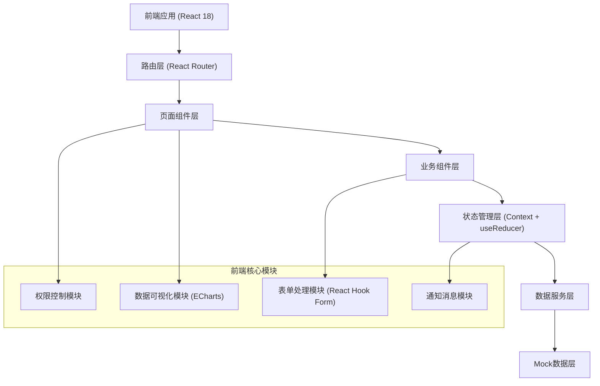
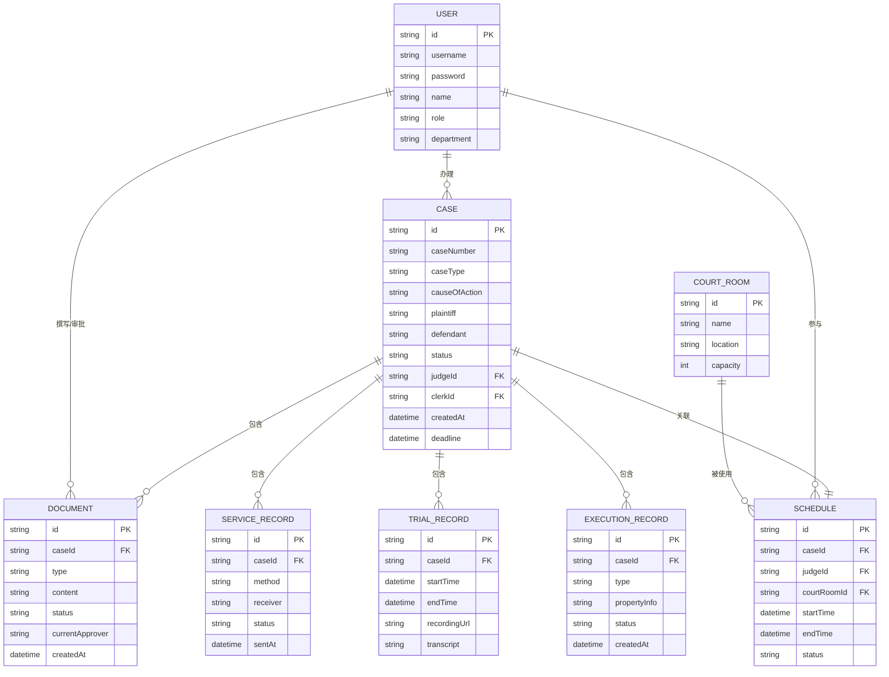

# 智慧法院全流程办案管理平台 技术架构文档

## 1. 架构设计



## 2. 技术描述

- **前端框架**: React@18 + TypeScript@5
- **构建工具**: Vite@5
- **样式方案**: TailwindCSS@3 + PostCSS
- **路由管理**: React Router Dom@6
- **图表可视化**: ECharts@5 + echarts-for-react
- **状态管理**: React Context + useReducer
- **表单处理**: React Hook Form@7
- **UI图标**: Lucide React
- **日期处理**: Day.js
- **后端**: 无后端，前端Mock数据
- **数据库**: 无数据库，使用TypeScript常量+localStorage模拟

## 3. 目录结构

```
src/
├── assets/              # 静态资源
│   └── images/
├── components/          # 公共组件
│   ├── layout/         # 布局组件
│   │   ├── Sidebar.tsx
│   │   ├── Header.tsx
│   │   └── MainLayout.tsx
│   ├── ui/             # 基础UI组件
│   │   ├── Button.tsx
│   │   ├── Card.tsx
│   │   ├── Table.tsx
│   │   ├── Modal.tsx
│   │   ├── FormItem.tsx
│   │   └── Select.tsx
│   └── charts/         # 图表组件
├── contexts/            # 全局上下文
│   ├── AuthContext.tsx
│   └── AppContext.tsx
├── hooks/               # 自定义Hooks
│   ├── useAuth.ts
│   └── usePermission.ts
├── pages/               # 页面组件
│   ├── Login.tsx
│   ├── Dashboard/
│   │   └── index.tsx
│   ├── CaseFiling/
│   │   └── index.tsx
│   ├── CaseAssign/
│   │   └── index.tsx
│   ├── Service/
│   │   └── index.tsx
│   ├── Scheduling/
│   │   └── index.tsx
│   ├── Trial/
│   │   └── index.tsx
│   ├── Document/
│   │   └── index.tsx
│   ├── Execution/
│   │   └── index.tsx
│   └── System/
│       ├── Users.tsx
│       └── Rules.tsx
├── router/              # 路由配置
│   └── index.tsx
├── types/               # TypeScript类型定义
│   ├── case.ts
│   ├── user.ts
│   └── common.ts
├── utils/               # 工具函数
│   ├── mock.ts
│   ├── permission.ts
│   └── format.ts
├── data/                # Mock数据
│   ├── cases.ts
│   ├── users.ts
│   └── stats.ts
├── App.tsx
├── main.tsx
└── index.css
```

## 4. 路由定义

| 路由路径 | 页面名称 | 权限要求 |
|----------|----------|----------|
| /login | 登录页 | 公开 |
| /dashboard | 首页大屏 | 登录用户 |
| /case-filing | 立案登记 | 书记员、法官 |
| /case-assign | 分案管理 | 书记员、庭长、院长 |
| /service | 送达管理 | 书记员 |
| /scheduling | 排期管理 | 书记员、法官 |
| /trial | 庭审管理 | 书记员、法官 |
| /document | 文书管理 | 法官、庭长、院长 |
| /execution | 执行管理 | 法官、执行员 |
| /system/users | 用户管理 | 管理员 |
| /system/rules | 规则维护 | 管理员 |

## 5. 核心数据模型

### 5.1 ER图



### 5.2 核心类型定义

```typescript
// 用户角色
type UserRole = 'clerk' | 'judge' | 'chief' | 'president' | 'admin';

// 案件状态
type CaseStatus = 'filed' | 'assigned' | 'served' | 'scheduled' | 'trial' | 'document' | 'closed' | 'executing';

// 用户
interface User {
  id: string;
  username: string;
  name: string;
  role: UserRole;
  department: string;
  avatar?: string;
}

// 案件
interface Case {
  id: string;
  caseNumber: string;
  caseType: 'civil' | 'criminal' | 'administrative' | 'execution';
  causeOfAction: string;
  plaintiff: string;
  defendant: string;
  status: CaseStatus;
  judgeId?: string;
  clerkId?: string;
  department?: string;
  estimatedDays: number;
  createdAt: string;
  deadline: string;
}

// 文书
interface Document {
  id: string;
  caseId: string;
  type: string;
  title: string;
  content: string;
  status: 'draft' | 'pending_chief' | 'pending_president' | 'approved' | 'rejected';
  approverLevel: number;
  currentApproverId?: string;
  createdAt: string;
  submittedAt?: string;
}

// 送达记录
interface ServiceRecord {
  id: string;
  caseId: string;
  method: 'sms' | 'email' | 'announcement';
  receiver: string;
  content: string;
  status: 'pending' | 'sent' | 'delivered' | 'failed';
  receiptUrl?: string;
  sentAt?: string;
}

// 排期
interface Schedule {
  id: string;
  caseId: string;
  judgeId: string;
  courtRoomId: string;
  startTime: string;
  endTime: string;
  status: 'scheduled' | 'completed' | 'cancelled' | 'queued';
}

// 庭审记录
interface TrialRecord {
  id: string;
  caseId: string;
  startTime: string;
  endTime?: string;
  recordingUrl?: string;
  transcript?: string;
  status: 'pending' | 'ongoing' | 'completed';
}

// 执行记录
interface ExecutionRecord {
  id: string;
  caseId: string;
  type: 'property_query' | 'seal' | 'freeze' | 'allocation';
  propertyInfo: string;
  amount?: number;
  status: 'pending' | 'processing' | 'completed' | 'failed';
  createdAt: string;
}
```

## 6. 权限控制策略

### 6.1 路由级权限
- 使用高阶组件 `withAuth` 包裹受保护路由
- 根据用户角色动态渲染侧边栏菜单
- 无权限访问时跳转至403页面

### 6.2 组件级权限
- 自定义Hook `usePermission` 提供权限检查方法
- 操作按钮根据权限动态显示/禁用
- 表格行操作根据角色展示不同选项

### 6.3 数据级权限
- 法官只能查看和操作自己负责的案件
- 庭长只能查看本庭室的案件数据
- 院长和管理员可查看全部数据

## 7. 数据大屏实现方案

### 7.1 实时数据刷新
- 使用 `setInterval` 每5秒模拟数据更新
- 数字滚动动画效果
- 图表平滑过渡动画

### 7.2 可视化图表
- 收结案趋势：折线图
- 各庭室对比：柱状图
- 上诉率热力图：热力图/地图
- 案由分布：饼图/环形图
- 执行到位率：仪表盘

### 7.3 数据筛选
- 支持多维度筛选（案由、法官、日期范围）
- 筛选条件变化时实时更新图表
- 一键导出Excel报告功能
